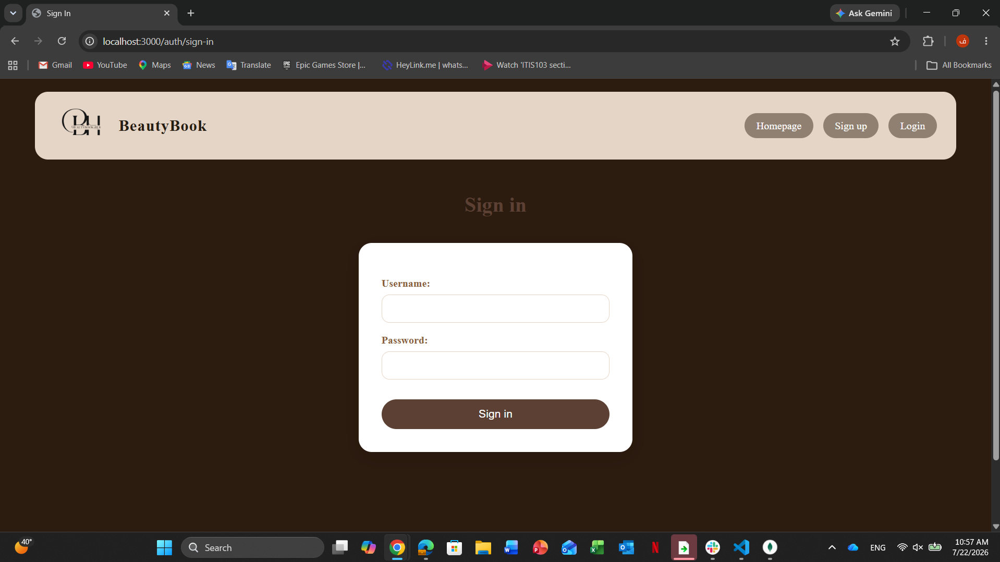
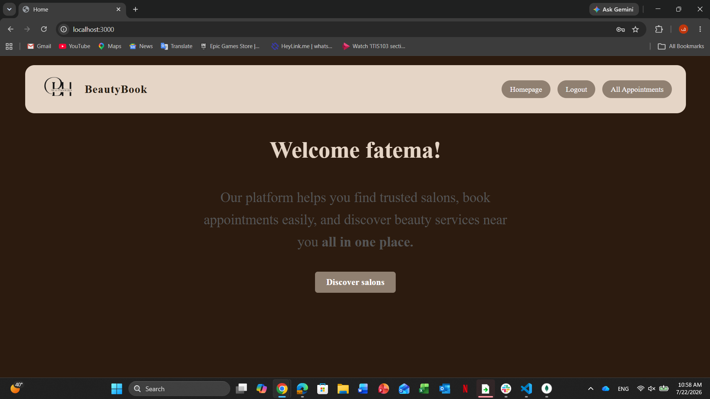
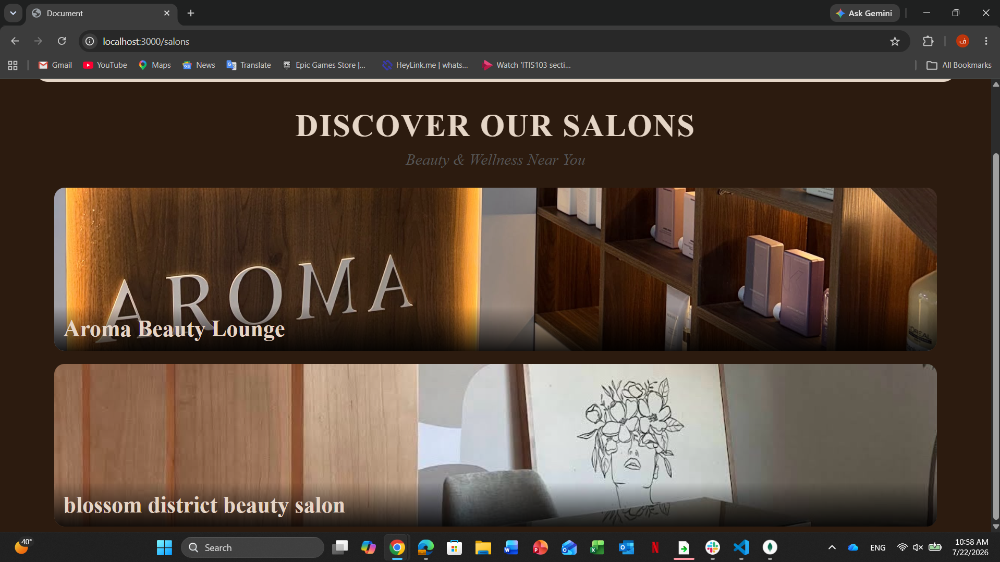
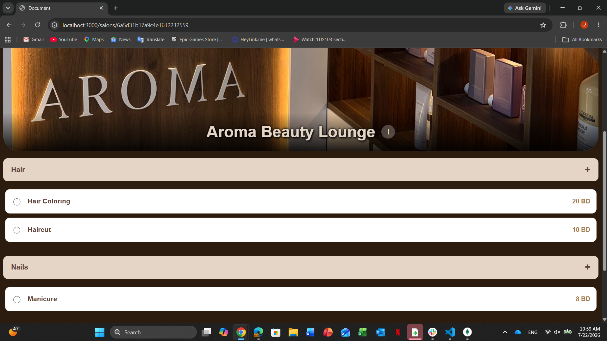
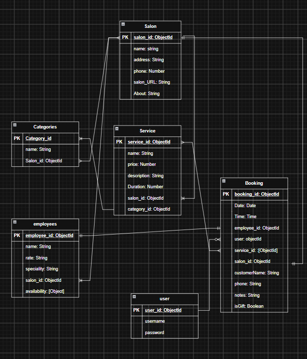

# Project Name
**BeautyBook Hub** Booking System
## Overview
**BeautyBook Hub** is a Salon Booking System is a web-based application designed to simplify and improve the appointment booking experience between customers and beauty salons. The system allows users to browse available salons, explore categories and services, select employees, choose suitable dates and time slots,and manage their appointments easily.

The goal of this project is to provide a convenient platform that reduces manual booking processes and helps salons organize their appointments efficiently.

The application provides a smooth user experience with a simple and organized interface, making it easier for customers to discover salons and schedule appointments without the need for phone calls or direct communication.
## Screenshots

## Technologies Used
- Draw.io
- (EJS) Embeded java script
- CSS
- JAVA SCRIPT
- HTML

## Getting Started
1. Clone the repository: 
`git clone <repository-url>`

2. Navigate to the project:
`cd project-name`

3. Install dependencies:
`npm install` 

4. Create a .env file:
Example:
`PORT=3000
MONGODB_URI=your_database_connection
SESSION_SECRET=your_secret`
5. Start the development server:
`npm run dev`
or
`npm start`
6. Visit:
http://localhost:3000
## Installation
1. Install node.js
## User Stories
### Customer

- As a customer, I want to create an account so that I can access the booking system and manage my appointments.

- As a customer, I want to browse available salons so that I can choose a salon that matches my preferences.

- As a customer, I want to view salon details info, categories, services, prices, and employees so that I can make an informed decision before booking.

- As a customer, I want to select a service so that I can book the treatment I need.

- As a customer, I want to choose my preferred employee so that I can receive the service from a specific staff member.

- As a customer, I want to see available dates and time slots so that I can schedule an appointment at a convenient time.

- As a customer, I want to create an appointment so that I can reserve my selected service and time.

- As a customer, I want to view my appointments so that I can keep track of my upcoming bookings.

- As a customer, I want to cancel an appointment so that I can remove bookings I no longer need.

- As a customer, I want to update my appointment details so that I can change the booking information when needed.

### System

- As a system, I want to prevent unavailable time slots from being booked so that appointments do not overlap.

- As a system, I want to store user and booking data securely so that information can be managed reliably.
## Database Design

## Routes

| Method | Route | Description |
|---------|-------|-------------|
| GET | / | Home page |
| GET | /salons | List all salons |
| GET | /salons/:salonid | one salon page |
| GET | /salons/booking/:serviceId | select date and time page |
| GET | /salons/booking-details | view personal info form |
| POST | /salons/booking-details | Create form |
| GET | salons/booking-details | show confirm page |
| DELETE | /salons/appoint/:id | Delete appointments |
| GET | /appoint/:id/update | show update form |
| PUT | /appoint/:id | Update appointment |

## Features
- User registration and authentication
- Browse available salons and categories with services
- View salon details and employees based on available dates and time.
- Create and manage appointments
- View upcoming and previous bookings
- Cancel appointments
- update appointment
- Store and manage booking information securely
- Is gift feature

## Future Enhancements
- A dashboard for salon owner or admin side 
- online payment
- customer reviews on each salon 
- print recipt 
- search feature on salons

## Credits
Special thanks to **Mr. Omar** for his guidance, support, and valuable feedback throughout the development of this project.